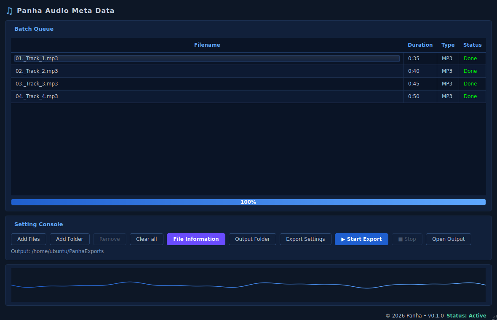
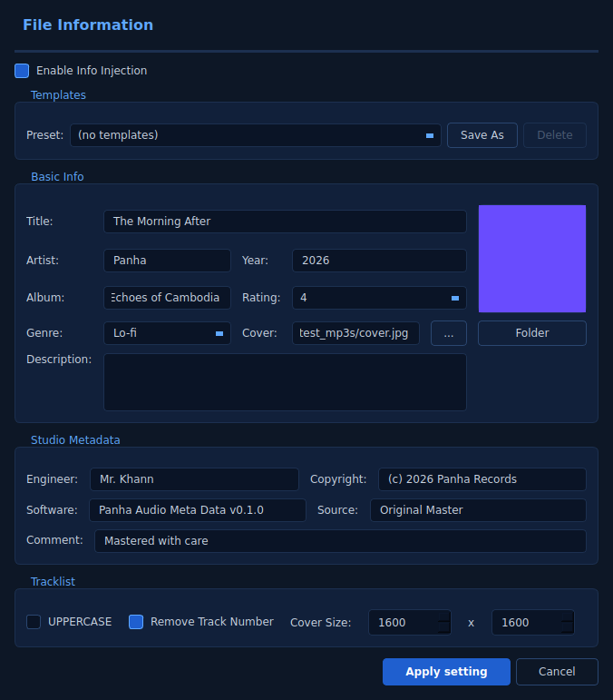

# Panha Audio Meta Data

A PyQt6 + ffmpeg desktop application for batch editing MP3 (and other audio) metadata
— cover art, title, artist, album, year, genre, comment, description, and studio fields.

The UI is inspired by the X-MIXM reference design (dark blue/cyan theme, batch queue,
File Information dialog, animated waveform).



| File Information dialog | Export Settings |
|---|---|
|  |  |

## Features

- **Batch queue** with filename, duration, type and status columns
- **File Information dialog** with all standard ID3v2 fields:
  - Title, Artist, Album, Year, Genre, Rating, Cover art, Description, Comment
  - Studio metadata: Engineer, Copyright, Software, Source
  - Tracklist options: UPPERCASE, Remove Track Number, Cover Size
  - **Templates**: save & reuse metadata presets to `~/.panha_templates.json`
- **Cover art** embedding from a file or "folder" (first image found in folder)
- **Export Settings** dialog (format, sample rate, bit depth, threads, mastering target)
- **Context menu** (right-click queue): Select all / Add / Remove / Start / Stop / Open output
- Multi-threaded background worker (UI stays responsive)
- Right-side animated waveform footer while exporting
- 100% pure ffmpeg backend (stream-copy by default, no quality loss)

## Requirements

- Python **3.10+**
- **ffmpeg** & **ffprobe** in `PATH` (or set `PANHA_FFMPEG` / `PANHA_FFPROBE`)

Install ffmpeg:

```bash
# Ubuntu / Debian
sudo apt-get install ffmpeg

# macOS
brew install ffmpeg

# Windows (Chocolatey)
choco install ffmpeg
```

## Installation

```bash
git clone https://github.com/<you>/panha-audio-metadata.git
cd panha-audio-metadata
python -m venv .venv
source .venv/bin/activate    # Windows: .venv\Scripts\activate
pip install -e .[dev]
```

## Run

```bash
python -m panha
# or
panha
```

## Usage

1. Click **Add Files** or **Add Folder** to populate the batch queue.
2. Click **File Information** and fill in the metadata you want to inject.
   - Optionally click **...** next to *Cover* to pick a single image, or **Folder**
     to point at a directory whose first image file will be used.
   - Click **Save As** to save the current panel as a reusable preset.
3. Click **Output Folder** to choose where processed files go.
4. (Optional) Click **Export Settings** to tweak format/sample rate/etc.
5. Click **Start Export**. Each file is processed with `ffmpeg -codec copy` so audio
   is **not re-encoded** — only the ID3v2 tag block and embedded artwork are rewritten.

## Programmatic use

The metadata writer is decoupled from the UI and can be used standalone:

```python
from panha.metadata import Metadata, write_metadata

meta = Metadata(
    title="The Morning After",
    artist="Panha",
    album="Echoes",
    year="2026",
    genre="Lo-fi",
    cover_path="/path/to/cover.jpg",
    comment="Mastered with Panha",
)
write_metadata("input.mp3", "output.mp3", meta)
```

## Development

```bash
pip install -e .[dev]
ruff check panha tests
pytest
```

## License

MIT — see [LICENSE](LICENSE).
